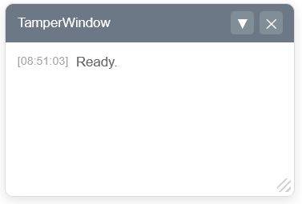

#Monkey Tools

## Tamper Window



### Header comments in the TamperMonkey script
```diff
-// ==UserScript==
-// @name         Example script
-// @namespace    http://tampermonkey.net/
-// @version      2026-01-19
-// @description  try to take over the world!
-// @author       You
-// @match        https://my-url.com/*
-// @grant        none
+// @require      https://raw.githubusercontent.com/vancaenegem/monkey-tools/main/TamperWindow.js
-// ==/UserScript==
```

### TamperWindow initialisation
```javascript
setTimeout(()=>{
  console.log ('%cTamperMonkey : init window...', 'color: green;');
  const tamperWin = document.createElement("tamper-window");
  document.body.appendChild(tamperWin);
  tamperWin.log (`Ready.`);
}, 1000);
```
